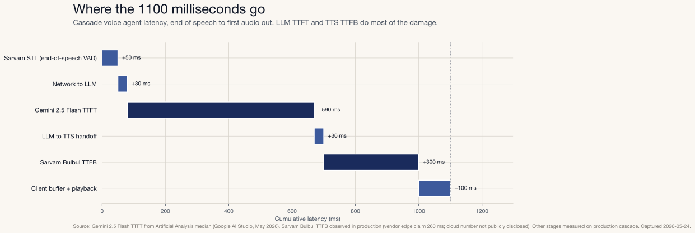
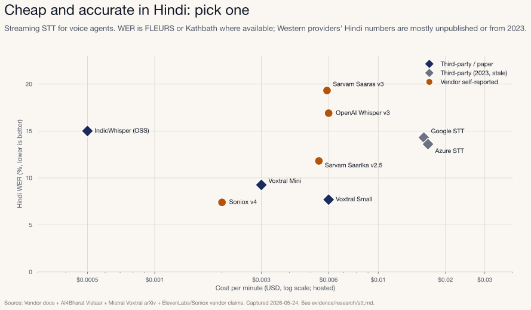
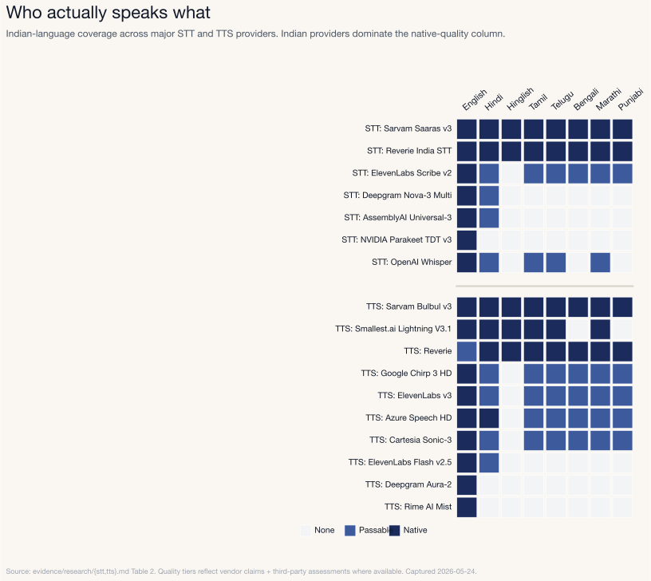
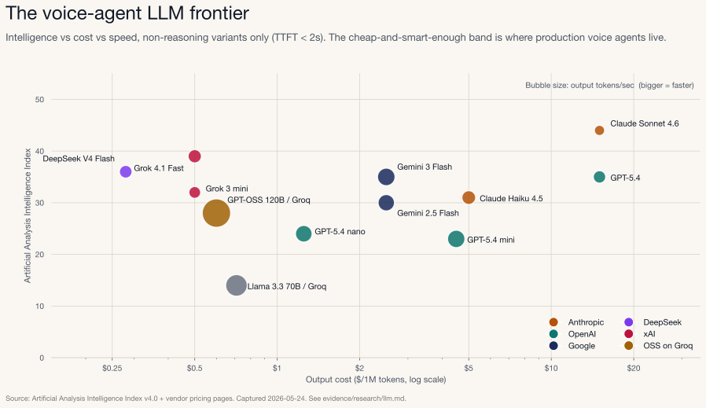
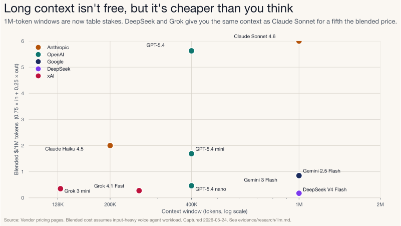
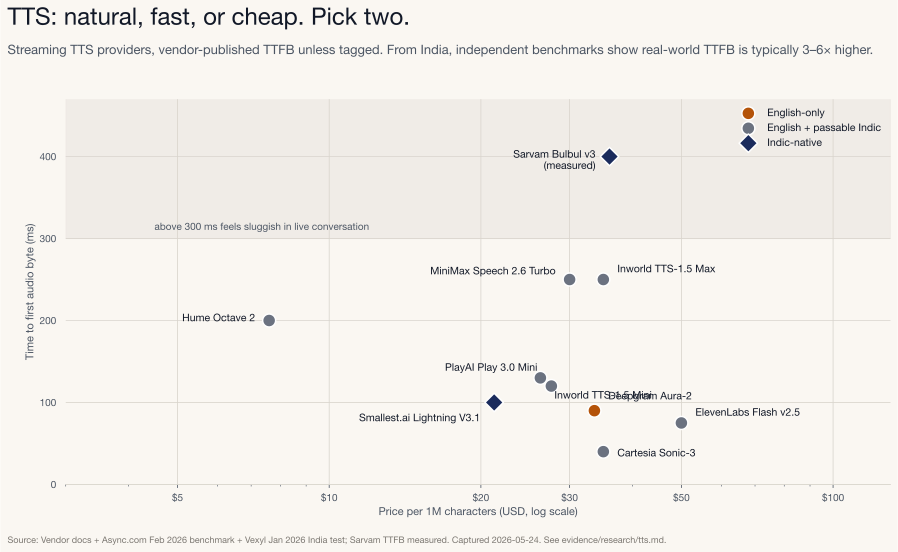
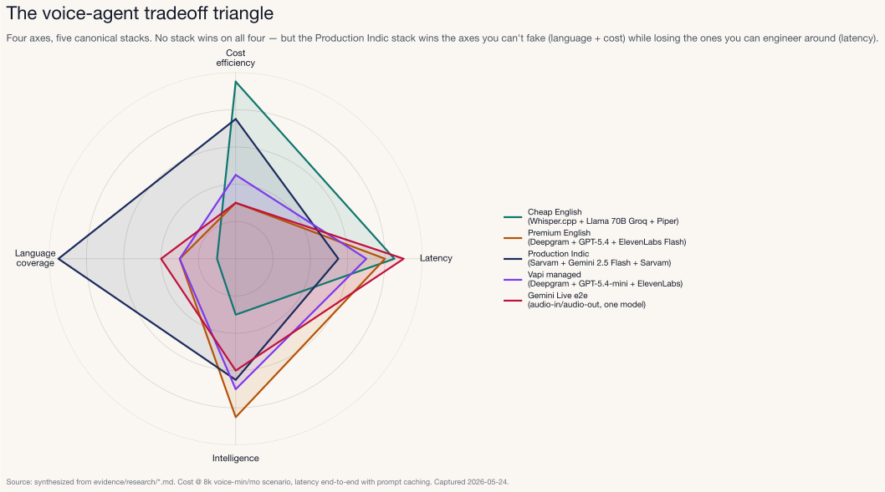
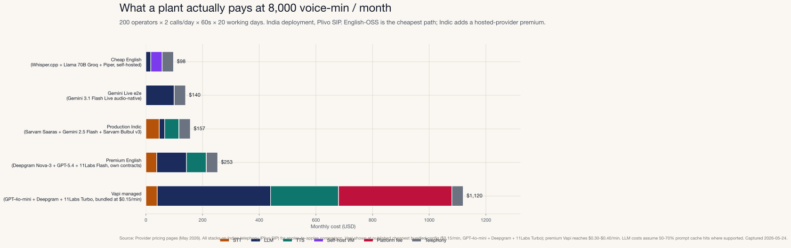
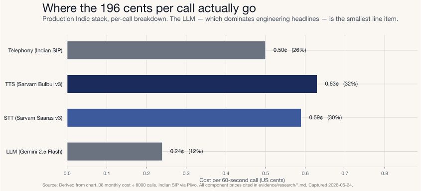

# The Voice Agent Tradeoff Triangle

## Cost, Latency, Language and Intelligence

*A production engineering view (and a CTO procurement view) of what it actually takes to ship a voice agent in 2026.*

---

It's 11:47 on a Tuesday morning on the assembly floor of an automobile plant on the outskirts of New Delhi. A welding robot on Line 3 has thrown a fault — red light, arm frozen mid-cycle. Anwar, the maintenance supervisor, is wearing gloves and safety glasses, standing two meters from a 200-tonne stamping press. He can't type. He has thirty seconds before the line stops.

He hits one button on a panel and speaks Hinglish:

> "Welding robot pe lal batti jal rahi hai, arm beech mein hi ruk gaya hai, spot weld miss ho raha hai shayad. Yeh urgent hai, line ruk gayi hai."

A voice agent answers in Hindi in about 1.1 seconds. Fast enough that Anwar stays on rhythm and the conversation feels real. (Humans notice pauses starting around 250-300 ms; under 1.5 s end-to-end is the threshold where voice conversations feel natural rather than transactional.) The agent asks the machine code, confirms the severity, files a work order, and notifies the maintenance head over WhatsApp. The whole exchange takes 47 seconds.

This isn't a demo. It's the kind of voice agent we run in production today. It's also the kind of system that, if you actually try to build it, forces you into a four-way tradeoff nobody in voice AI marketing is honest about.

This post is about that tradeoff.

---

## The thesis

A production voice agent lives at the intersection of four constraints:

- **Cost.** What one minute of conversation actually costs you, at scale.
- **Latency.** End-of-speech to first-audio-out. The only latency number that matters.
- **Intelligence.** Does the model understand the operator's intent and produce a useful response.
- **Language.** Does it work in the language your users actually speak, including code-switching.

You can't maximize all four. Most voice-agent decisions are really decisions about *which axis you can't compromise on*. Pick wrong and you ship something technically impressive and operationally useless.

We'll work through this in two passes. The first is for ML and backend engineers: how the pipeline fits together, where the milliseconds and dollars go, what we've measured. The second is for CTOs and engineering leaders: what this costs at 8,000 voice-minutes per month, where the procurement decisions live, and what to ask vendors.

Every number is cited. Where a number is vendor-self-reported, we say so. Where it's measured, we say so.

---

## 1. The pipeline, end-to-end

"Voice agent" describes two completely different things. Worth getting that straight before we go further.

**Cascade.** Three specialized models stitched together. STT transcribes the audio. An LLM decides what to say. TTS renders the reply as audio. Three vendors, three handoffs, three places for things to break. Most engineering effort goes into the seams.

**End-to-end.** One audio-native LLM. Audio in, audio out. No intermediate text. Gemini Live and OpenAI's Realtime models are the canonical examples. Fewer hops, lower latency, different cost curve, weaker language coverage.

Cascade is where production stacks live today. End-to-end is catching up on quality, but it still costs more per minute and loses badly on Indian languages, especially when speakers code-switch mid-sentence.

### Where the latency actually goes

Our production cascade: Sarvam Saaras streaming STT, Gemini Flash, Sarvam Bulbul streaming TTS. Here's the budget.

Two stages dominate. Gemini Flash TTFT is around 590 ms (Artificial Analysis median). Sarvam Bulbul TTFB is around 300 ms. Everything else is noise. If you're optimizing latency without touching those two, you're not optimizing anything.

The Gemini number isn't ours; it's the published median. We re-ran our own benchmark to sanity-check it: 32 calls of the same 1,500-token Hinglish system prompt against a comparable hosted model. Numbers lined up. Raw data sits in `benchmark/results/warm_turn_*.json` if you want to verify.

One thing most teams get wrong: they obsess over STT. Modern streaming STT adds maybe 50 ms after end-of-speech. That's not the problem. The model generating the response and the audio synthesizing it are the problem. In that order.

---

## 2. STT, where the language axis hits first

STT is where the language decision either solves itself or owns you.

English is solved. The STT market for English-only voice agents is now a commodity. Whisper large-v3 hits ~2% WER on LibriSpeech test-clean and ~5% on Common Voice 15. Parakeet RNNT runs faster than real time on a single A10. Deepgram Nova-3 streams with ~150 ms TTFT (Deepgram's own benchmark says 5.26% WER on real-world audio; Artificial Analysis says 12.8% on the same model, which tells you everything about vendor vs independent numbers). AssemblyAI Universal-3 Pro Streaming hits ~1.56% WER at $0.0075/min. You can ship a production English voice agent with $0/min STT cost on self-hosted Parakeet or Whisper.cpp and nobody will notice.

Indian languages are not solved. If your users speak Hindi, Tamil, Telugu, Bengali, Marathi, Kannada, Malayalam, Gujarati, Punjabi, Odia, or any of the other 22 official Indian languages, and especially if they code-switch (Hinglish, Tanglish, Tenglish; every real Indian conversation does this), the picture changes completely.

A few honest observations from this chart:

- **NVIDIA Parakeet TDT v3, the latest and fastest variant on the Hugging Face Open ASR Leaderboard, does not support Hindi.** The TDT v3 release covers 25 European languages. Hindi, Chinese, Japanese, Korean, and Arabic are all absent. NVIDIA's older Parakeet RNNT 1.1B multilingual variant does cover Hindi (`hi-IN`), but it's the slower architecture, not the headline TDT generation. The flagship OSS ASR frontier is openly skipping Indic languages. ([Parakeet TDT 0.6B v3 model card](https://huggingface.co/nvidia/parakeet-tdt-0.6b-v3) and [RNNT 1.1B multilingual](https://build.nvidia.com/nvidia/parakeet-1_1b-rnnt-multilingual-asr/modelcard), captured 2026-05-24.)

- **The Indian providers occupy the price-quality frontier for Indian languages.** Sarvam Saaras v3 covers all 22 official Indian languages plus English at $0.0059/min (₹30/hour) and posts 19.31% WER on the IndicVoices benchmark across the top 10 languages. Reverie offers quote-based pricing. Soniox sits at $0.002/min with 7.4% Hindi WER on their own benchmark. Western providers (Google STT, Azure STT) sit at $0.016/min with 13-14% WER on the 2023 AI4Bharat Vistaar benchmark (the most recent third-party multi-vendor data available), and their coverage of Tamil, Telugu, Bengali, Marathi, Kannada, Malayalam, and Gujarati ranges from "supported but underbenchmarked" to "missing entirely." ([Sarvam Saaras blog](https://www.sarvam.ai/blogs/asr), [AI4Bharat Vistaar](https://github.com/AI4Bharat/vistaar), both captured 2026-05-24.)

- **Real-world Indic WER is much worse than benchmark numbers.** AI4Bharat reports Hindi WER blowing up to 22-30% on telephony audio; the gap is similar or worse for Tamil, Bengali, Marathi, and lower-resourced languages where training data is sparser. Sarvam's IndicVoices number (~19% on Saaras v3) is closer to shop-floor reality than the clean-audio numbers any vendor publishes. Budget for that. ([AI4Bharat IndicVoices study](https://ai4bharat.iitm.ac.in/areas/asr).)

### So which STT?

If your voice agent is English-only:
- **Cheapest:** Groq Whisper Large v3 Turbo at $0.04/hour ≈ $0.00067/min. ([Groq pricing](https://groq.com/pricing), 2026-05-24.)
- **Lowest TTFT:** Deepgram Nova-3 at ~150 ms US-region. AssemblyAI Universal-3 Pro Streaming at ~1.56% English WER and $0.0075/min.
- **OSS path:** Faster-Whisper large-v3 on your own GPUs.

If your voice agent must handle Indian languages (Hindi, Tamil, Telugu, Bengali, Marathi, Kannada, Malayalam, Gujarati, Punjabi, Odia, or any other Indic language, including the code-mixed dialects):
- **Production default:** Sarvam Saaras v3 at $0.0059/min. All 22 official Indian languages plus English, native code-mix handling, sub-150 ms TTFT in fast mode. Sarvam has explicitly tuned Bulbul (their TTS) for 8 kHz telephony bandwidth, which is exactly the channel a phone-based manufacturing voice agent runs on.
- **Strong open-source alternative:** AI4Bharat IndicConformer-600M-Multi. Covers all 22 Indian languages, MIT-licensed, RNNT streaming under 100 ms latency on self-hosted GPU. The only OSS Indic ASR that meaningfully challenges Sarvam on language breadth.
- **OSS path with effort:** Mistral Voxtral Small. Apache-licensed, 7.69% FLEURS Hindi, but no native streaming infrastructure yet. Needs production wrapping.
- **Don't bother with:** Parakeet TDT (no Indic), Deepgram Aura-2 (no Indic, that's TTS but worth flagging), AssemblyAI for languages beyond Hindi (limited coverage in Tamil/Telugu/Bengali).

### The provider coverage matrix

When a CTO asks "can we support all our regions with one provider?", the answer is almost never yes:

Sarvam and Reverie span all 22 Indian languages. Smallest.ai covers 7 of them: Hindi, Tamil, Telugu, Kannada, Malayalam, Marathi, Gujarati. Notably no Bengali or Punjabi. Western providers cover English natively, Hindi passably, and most are simply absent for Tamil, Telugu, Bengali, Marathi, Kannada, Malayalam, Gujarati, Punjabi, and Odia. If your operators or customers speak more than one Indian language, you're picking Sarvam, Reverie, or AI4Bharat (OSS). Full stop.

---

## 3. LLM: the inner triangle

The LLM is where cost, latency, and intelligence pull in three different directions hardest.

Throughput-per-minute and context window? Mostly irrelevant for voice agents. Two things actually matter.

- **TTFT (time to first token).** Sets the floor on perceived latency. Anything over ~700 ms feels sluggish.
- **Cost per call.** A 60-second voice call generates roughly 3,000 input tokens (system prompt + 7 turns of transcript) and 600 output tokens (7 short agent replies). Pick that envelope, and the model picks itself.

Here's the voice-agent-relevant LLM frontier. Non-reasoning variants only, because anything with reasoning enabled has 5+ second TTFT and is unusable for live conversation.

Three things jump out.

1. **The Indian/OSS cluster on the left is competitive.** DeepSeek V4 Flash at $0.14/$0.28 per 1M tokens with AA Intelligence Index 36 (non-reasoning) is, for voice-agent purposes, smarter than Claude Haiku 4.5 and 7× cheaper. ([DeepSeek pricing](https://api-docs.deepseek.com/quick_start/pricing), [Artificial Analysis leaderboard](https://artificialanalysis.ai/leaderboards/models), 2026-05-24.) Grok 4.1 Fast at $0.20/$0.50 with AA Index 39 is similar. The Western premium is real but it isn't 10×.

2. **Big bubbles aren't smart.** Llama 3.3 70B on Groq is the giant teal bubble at 280 tokens/sec. Beautiful throughput, AA Index 14. Fast doesn't mean smart enough for slot-filling on a Hinglish work order. The voice-agent sweet spot is a small-medium bubble at $0.25-$1.00/1M output: Gemini 3 Flash, DeepSeek V4 Flash, Grok 4.1 Fast, GPT-OSS 120B on Groq.

3. **The reasoning models aren't on this chart.** Claude Sonnet 4.6 in non-reasoning mode is here (AA Index 44 at 1.34s TTFT). With max reasoning it would be at AA 52 and 81 seconds of TTFT. You can't have a voice agent that takes 81 seconds to start speaking. Reasoning is for offline batch.

### Prompt caching changes everything

The single biggest cost lever on a system-prompt-heavy voice agent is **prompt caching**. (Every voice agent is system-prompt-heavy because the agent needs ~1500 tokens of instructions, asset catalog, and Hinglish examples to work.)

Numbers from the research:

| Provider | Cached input discount | TTL | Source |
|---|---|---|---|
| Anthropic Claude (5-min cache) | 90% off cache reads | 5 minutes | [claude.com pricing](https://platform.claude.com/docs/en/about-claude/pricing) |
| Anthropic Claude (1-hour cache) | 80% off cache reads, +25% on writes | 1 hour | same |
| Google Gemini (implicit) | ~90% off cached tokens | implicit | [ai.google.dev pricing](https://ai.google.dev/gemini-api/docs/pricing) |
| OpenAI cached input | 75–90% off | implicit (10-min retention) | [developers.openai.com pricing](https://developers.openai.com/api/docs/pricing) |
| DeepSeek context caching | **98% off** | implicit | [api-docs.deepseek.com](https://api-docs.deepseek.com/quick_start/pricing) |
| xAI Grok cached input | 75% off | implicit | [docs.x.ai](https://docs.x.ai/developers/models) |

A worked example: 1500-token system prompt on Claude Sonnet 4.6, 1000 calls/day.

- Without cache: 1000 × 1500 × $3.00/1M = **$4.50/day** input alone.
- With 5-min cache (assume 90% hit rate): 1000 × 1500 × ($3.00 × 0.1 + $3.00 × 0.9 × 0.10) = **$0.66/day**.

That's 7× the cost wiped out by *one config flag*. If your voice agent doesn't use prompt caching, you're paying for nothing.

### Context window pricing

A million-token context is now table stakes. But it is not free, and it is not flat across vendors:

DeepSeek V4 Flash gives you a 1M-token context at $0.21 blended per 1M tokens. Claude Sonnet 4.6 gives you the same 1M context at $6 blended. That's a 29× price spread for the same capability ceiling. Obviously you're paying for AA Index 44 on Sonnet vs 36 on DeepSeek, but still.

For voice agents, the practical context window need is much smaller than this suggests. A 7-turn call uses maybe 4,000 tokens of history. The 200K window on Haiku 4.5 is already overkill. Optimize for cost-per-call, not context.

---

## 4. TTS, where naturalness costs you

TTS is the dirtiest fight in voice AI in 2026. Lots of marketing, less honesty.

The metric that matters is **TTFB (time to first audio byte)**. Total synthesis time doesn't matter as much as you'd think. Audio streams, the client buffers, the operator hears something. Latency is felt at the first byte, not the last.

The story this chart tells:

- **Cartesia Sonic-3 is the published TTFB winner at ~40 ms.** Deepgram Aura-2 at 90 ms. ElevenLabs Flash v2.5 at 75 ms inference-only. These are vendor-published numbers.

- **Independent benchmarks tell a different story.** Async.com measured ElevenLabs Flash v2.5 at 251 ms median TTFB from us-central1. Vexyl measured the same model at **478 ms from India**. That's 6× the vendor claim. The vendor number excludes network round-trip, which is exactly the thing voice agents can't exclude. ([Async TTS benchmark](https://async.com/blog/tts-latency-vs-quality-benchmark/), [Vexyl India test](https://vexyl.ai/elevenlabs-tts-latency-test-2026-real-world-results/), both captured 2026-05-24.)

- **Sarvam Bulbul v3 has no published TTFB.** The 300 ms point on this chart is *measured* on our production cascade. Observably correct on the apps/voice stack but not reproducible from a vendor page. That's the chart's honest gap.

- **Inworld TTS-1.5 Max is now #1 on Artificial Analysis ELO (1,236),** better than ElevenLabs v3 (1,179), and *5-20× cheaper*. This rewrites the "ElevenLabs is the quality benchmark" assumption that dominated 2024-25 voice agent design. ([Artificial Analysis TTS](https://artificialanalysis.ai/text-to-speech), 2026-05-24.)

- **Sarvam Bulbul v2 at $18/M chars is dramatically cheaper than every Western Hindi-capable provider.** 5.5× cheaper than ElevenLabs Multilingual v2 at $100/M. For Indian manufacturing voice agents this is the dominant economic argument.

### Three TTS providers we'd never use again for English voice agents

- **Deepgram Aura-2.** Excellent English quality, 90 ms TTFB, but **no Hindi**. Only 7 languages. If you ever need to expand beyond English you have to swap. ([Deepgram TTS models](https://developers.deepgram.com/docs/tts-models).)
- **Rime AI Mist.** English-only. Strong streaming but again, language-limited.
- **Speechmatics TTS.** New entrant Q2 2026, English-only at launch.

### TTS providers worth knowing about

The chart above shows the providers most voice-agent teams actually pick from, but a few more are worth noting:

- **MiniMax Speech 2.6 HD.** $100/M chars, Artificial Analysis ELO ~1,156 (second tier behind Inworld and ElevenLabs v3). Strong multilingual; emerging quality contender.
- **Hume AI Octave 2.** $7.60/M chars at the high tier with ~100 ms latency. The cheapest "natural-enough" TTS that doesn't sacrifice prosody. Worth piloting for English-leaning agents.
- **Kokoro 82M (open-weight).** ~$0.70/M chars effective cost when self-hosted (Apache-licensed), Artificial Analysis ELO ~1,059, runs real-time on a CPU. The cheapest viable OSS English TTS in 2026.

The 2024 instinct was "use ElevenLabs for everything." The 2026 reality is: pick by language coverage first, latency second, quality third. Inworld and Sarvam will likely take ElevenLabs's voice-agent market share over the next 12 months. And the open-weight options (Kokoro, Piper) have closed the gap enough that English self-hosting is genuinely viable.

---

## 5. The four-axis tradeoff visualized

All of the above collapses into one picture.

Axes normalized 0 to 1, higher is better. Cost efficiency means cheaper. Latency means lower end-to-end ms. Intelligence is AA Index plus Hindi capability blended. Language coverage runs from English-only to multi-Indic.

No stack wins on all four. That's the entire point.

- **Cheap English (Whisper.cpp + Llama 3.3 70B on Groq + Piper).** Maximum on cost, near-maximum on latency, mediocre on intelligence (Llama 14 AA Index), low on language. Use when you have a budget constraint and an English-only user base.
- **Premium English (Deepgram + GPT-5.4 + ElevenLabs Flash).** Wins on intelligence, second on latency, expensive, English-first. Use when the language constraint is solved and you can pay for quality.
- **Production Indic (Sarvam Saaras + Gemini 2.5 Flash + Sarvam Bulbul).** Maximum on language. All 22 Indian languages plus English, with native code-mix handling. Second on cost. Middling on latency (India-to-US network round trips dominate). This is what we run.
- **Vapi managed.** Middle of every axis. You are paying ~$0.05/min for orchestration, retries, telephony, observability.
- **Gemini Live e2e.** Highest latency score (one round trip), low cost, English-leaning, lower intelligence ceiling than the best cascade options. The "audio-native" play.

The framework is simple. **Find the axis you can't bend. Optimize the other three around it.** A manufacturing CMMS for Indian operators can't bend Language. A US telesales pilot can't bend Latency. A 12-market consumer app can't bend Cost. Everyone else has more flexibility than they think.

---

## 6. What this actually costs at 8,000 voice-min/mo

The scenario every CTO actually wants modeled: 200 maintenance operators, 2 calls per shift, 60 seconds per call, 20 working days per month. ~8,000 voice-minutes/month.

A few procurement-grade observations:

- **Cheap English on OSS is the cheapest production stack at ~$98/mo.** A fully self-hosted Whisper.cpp + Piper TTS pair on a $40/mo VPS, with Llama 3.3 70B on Groq for the LLM, hits the floor of what a production English voice agent costs in 2026. The tradeoffs are real: Llama 3.3 70B's intelligence is AA Index 14 (versus Gemini Flash's 35), STT latency on a CPU VPS is higher than hosted alternatives, and you take on operational responsibility for the OSS infrastructure. But the bill is small.

- **Production Indic is $157/mo, about $60/mo more than English-OSS.** That $60 gap is the *Indic language premium*. No production-grade OSS STT or TTS exists for Indian languages yet, so you pay Sarvam for hosted Saaras (STT) and Bulbul (TTS). Per-minute all-in is about $0.020. Still less than a single SaaS seat for a 200-operator plant.

- **Gemini Live e2e lands at $140/mo for English-leaning use cases.** Audio-native LLM pricing is now genuinely competitive, between Cheap English ($98) and Production Indic ($157). The deciding factor is language coverage and intelligence ceiling, not cost.

- **Premium English at $253/mo** is what you pay if you want paid Deepgram + GPT-5.4 + ElevenLabs. Roughly 2.5× more than OSS English for incrementally better quality and zero infrastructure work.

- **Vapi managed is by far the most expensive at ~$1,120/mo, and that's the cheapest Vapi configuration.** Vapi's published cheapest stack (GPT-4o-mini + Deepgram + 11Labs Turbo at ~$0.15/min) lands at $1,120/mo at our 8k voice-min scenario. Premium Vapi configs (GPT-4o + 11Labs Multilingual) reach $0.30-$0.40/min, or $2,400-$3,200/mo. Vapi's $0.05/min platform fee is only about a third of the cheapest-config bill; the rest is Vapi's marked-up bundled provider rates. Vapi makes sense when you need telephony, retries, observability, multi-call routing, and your engineering team would burn more than $1,000/mo of time implementing those primitives.

- **Indian-region voice platforms price differently.** Bolna lists ~₹5.52/min (≈ $0.066/min) for their Indian voice-agent platform. Western per-minute pricing on Vapi/Retell maps to roughly $0.15-$0.30/min equivalent. The Indian platforms are 30-50% cheaper than Western equivalents at comparable feature scope, but the gap shrinks once you BYO providers on either side.

### One more thing CTOs ask about: compliance

In India, voice agents touch four compliance surfaces every procurement review covers. **DPDP** (Digital Personal Data Protection Act, 2023) for any PII captured in transcripts. **TRAI** (telecom regulator); outbound calls need DLT registration for many use cases. **RBI** if your voice agent handles any financial intent, BFSI guidelines apply. And the new **AI Act** drafts under MeitY. Sarvam, Bolna, and Reverie all have India data residency. Vapi and Western platforms typically route through US datacenters, fine for most manufacturing use cases but worth confirming before signing a contract.

### Where the money inside one call actually goes

Per-call breakdown for the Production Indic stack:

The LLM, which dominates engineering blog headlines, is the **smallest** line item on a Hinglish voice call. TTS is the biggest (Sarvam Bulbul billed per character), telephony is second, STT is third, LLM is fourth.

This breakdown changes everything about where to optimize. If a CTO asks "should we move from Gemini Flash to Haiku 4.5?", the answer is "it won't materially change your bill." If they ask "should we cut the agent's verbosity from 7 turns to 4?", the answer is "yes, because TTS is your biggest line item."

---

## 7. Latency optimization: what actually moves the needle

If your cascade is sitting above 2 seconds end-to-end, you're almost certainly doing some combination of three things wrong: using HTTP request-response instead of persistent connections to your providers, generating the LLM response in full before starting TTS, or running services in a region distant from your providers' endpoints. None of these are subtle. They're the mistakes every voice-agent team makes on first deploy.

The general patterns that work, in descending order of impact:

- **Stream every stage of the pipeline.** STT should emit partial transcripts as audio arrives; LLM should stream tokens; TTS should synthesize on incoming chunks. If any one stage waits for the previous to complete, you've serialized the pipeline and given up the biggest single latency lever you have.
- **Persistent connections to your providers.** Per-turn HTTP handshakes (TLS, DNS, TCP) easily add 200-500 ms before any actual work happens. Most modern voice-AI providers expose WebSocket or HTTP/2 keepalive surfaces. Use them.
- **Prompt caching.** Voice-agent system prompts run 1,500–3,000 tokens (instructions + catalog + few-shot examples) and are constant across the call. Caching this prefix produces a step-change in TTFT, not just cost. Anthropic, Google Gemini, OpenAI, DeepSeek, and xAI all support some form (75-98% cost discount, similar-magnitude latency savings on a cache hit).
- **Co-locate with your providers' regions.** Sarvam serves from ap-south-1. Google Gemini exposes ap-south-1 endpoints. Deepgram has multiple regional options. Running your voice orchestrator from us-east-1 against ap-south-1 providers costs ~200 ms of round-trip on every single API call.
- **Tune VAD for your actual speakers.** Default end-of-speech thresholds are conservative (300-500 ms of silence). Most voice agents work fine at 150-200 ms with care taken not to cut off slower or older speakers. The savings compound across every turn.

A useful rule for procurement: assume vendor TTFB is +50% from your region, and ask for end-to-end p95 numbers from a comparable production deployment, not lab-conditions p50.

---

## 8. Cost optimization: the engineering deep dive

Four levers, in descending impact order:

1. **Use the smallest LLM that passes your eval.** Voice agent tasks (slot-filling, asset code lookup, severity classification) are not where the bigger models earn their price. Build a 30-turn evaluation harness (Daily/Pipecat's open-source [aiewf-eval](https://www.daily.co/blog/benchmarking-llms-for-voice-agent-use-cases/) is a reasonable starting point) and run your top transcripts through Haiku 4.5, Gemini 2.5 Flash, Grok 4.1 Fast, and DeepSeek V4 Flash. Pick the cheapest one that gets 95%+ of the larger model's output. Most teams settle on the 80%-quality bracket and that's fine.

2. **Truncate transcripts aggressively.** A 7-turn call is ~4,000 tokens. A 20-turn call is 12,000. Voice context isn't precious. Summarize old turns into 100 tokens of "what's been said so far" after the 5th turn. Saves 30-50% on long-call cost.

3. **Pick TTS by character price, not voice cloning fidelity.** Per chart 6, $5/M Inworld Mini at Enterprise floor vs $100/M ElevenLabs Multilingual is a 20× spread for the same use case. Your operators will not notice the voice clone. The CFO will notice the bill.

4. **Self-host the cheap stuff if you have GPUs idle.** Piper TTS on a CPU is real-time. Whisper.cpp on consumer hardware is real-time. Kokoro 82M (open-weight, Apache-licensed) runs real-time on CPU too. If your STT + TTS is English-only and you have spare compute, you can take those line items to near-zero. The savings only matter at scale (above ~50k voice-min/mo), but at scale they compound fast.

The prompt-caching lever is covered separately in section 3. Worth treating it as a sixth axis of architecture decision, not just a cost optimization.

---

## 9. The honest conclusion

No best stack exists. There's just the stack that matches what you can't compromise on.

Can't bend Cost? Self-host. Whisper.cpp, Llama 3.3 70B on Groq, Piper. Near-zero variable cost. You'll pay for it in latency and intelligence.

Can't bend Latency? Pay for an audio-native LLM. Deepgram, GPT-5.4, ElevenLabs Flash, all in the same region as your users. You'll pay for it in cost.

Can't bend Intelligence? Claude Sonnet 4.6 or GPT-5.4. Cache aggressively. Expect $300-500/mo at 8k voice-min. You'll pay for it in cost.

Can't bend Language? Use a stack built for the languages your users actually speak. For India that means Indic-tuned STT and TTS plus an LLM that handles code-switching cleanly. The round-trip to providers will push you above a second end-to-end. You'll pay for it in latency.

The decision isn't "which vendor wins." The decision is "which axis am I optimizing." Get that right first. Everything else follows.

---

*ContextWeaver builds production voice agents for Indian manufacturing: work orders, preventive maintenance, voice intake, WhatsApp escalation. If you want a deep-engineering tour of a production voice agent in India, talk to us.*
